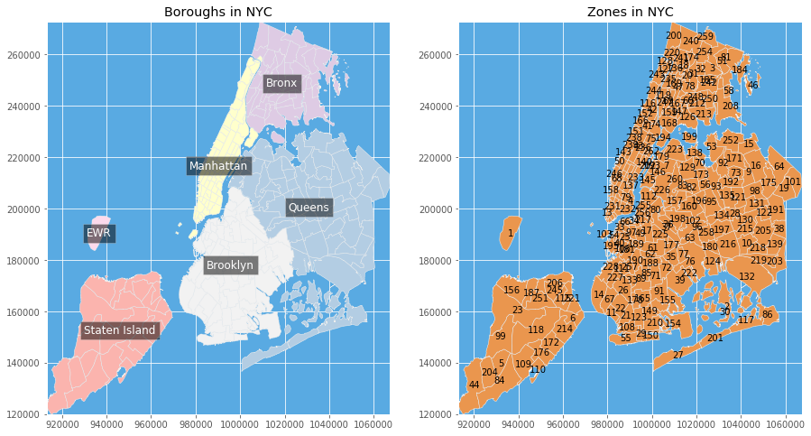

<a href="https://colab.research.google.com/github/pratyushchry/New-York-Taxi-Dataset/blob/master/New_York_Taxi_Trips_%7C_Data_Analytics.ipynb" target="_parent"></a>

# Downloading all the Data Analytics Packages 


```python
# Donwloading all the data analytics packages

import numpy as np
import pandas as pd
import urllib.request
import zipfile
import random
import math
import itertools
```


```python
# Downloading few other packages for visualizing the data extracted from the the link
# !pip install pyshp - for downloading shapefile

import shapefile
from shapely.geometry import Polygon
from descartes.patch import PolygonPatch
import matplotlib as mpl
import matplotlib.pyplot as plt
plt.style.use('ggplot')

%matplotlib inline
```

# Downloading and exploring the data
The data we will be analyzing here will be of 10 months. The size of the file is 4 GB and hence we would need a database/Python SQL toolkit that gives application developers and data science noobs like me the full power and flexibility of SQL. 


```python
# We will be using SQL Alchemy - a Python SQL Toolkit and Object Relational Mapper

from sqlalchemy import create_engine
nyc_database = create_engine('sqlite:///nyc_database.db')
```


```python
# Download the Trip Record Data
for month in range(1,4):
    urllib.request.urlretrieve("https://s3.amazonaws.com/nyc-tlc/trip+data/"+ \
                               "yellow_tripdata_2018-{0:0=2d}.csv".format(month), 
                               "nyc.2018-{0:0=2d}.csv".format(month))

# Download the location Data
urllib.request.urlretrieve("https://s3.amazonaws.com/nyc-tlc/misc/taxi_zones.zip", "taxi_zones.zip")
with zipfile.ZipFile("taxi_zones.zip","r") as zip_ref:
    zip_ref.extractall("./shape")
```


```python
df = pd.read_csv("nyc.2018-01.csv", nrows=10)
df.head()
```


<div>
<style scoped>
    .dataframe tbody tr th:only-of-type {
        vertical-align: middle;
    }

    .dataframe tbody tr th {
        vertical-align: top;
    }

    .dataframe thead th {
        text-align: right;
    }
</style>
<table border="1" class="dataframe">
  <thead>
    <tr style="text-align: right;">
      <th></th>
      <th>VendorID</th>
      <th>tpep_pickup_datetime</th>
      <th>tpep_dropoff_datetime</th>
      <th>passenger_count</th>
      <th>trip_distance</th>
      <th>RatecodeID</th>
      <th>store_and_fwd_flag</th>
      <th>PULocationID</th>
      <th>DOLocationID</th>
      <th>payment_type</th>
      <th>fare_amount</th>
      <th>extra</th>
      <th>mta_tax</th>
      <th>tip_amount</th>
      <th>tolls_amount</th>
      <th>improvement_surcharge</th>
      <th>total_amount</th>
    </tr>
  </thead>
  <tbody>
    <tr>
      <th>0</th>
      <td>1</td>
      <td>2018-01-01 00:21:05</td>
      <td>2018-01-01 00:24:23</td>
      <td>1</td>
      <td>0.5</td>
      <td>1</td>
      <td>N</td>
      <td>41</td>
      <td>24</td>
      <td>2</td>
      <td>4.5</td>
      <td>0.5</td>
      <td>0.5</td>
      <td>0.00</td>
      <td>0</td>
      <td>0.3</td>
      <td>5.80</td>
    </tr>
    <tr>
      <th>1</th>
      <td>1</td>
      <td>2018-01-01 00:44:55</td>
      <td>2018-01-01 01:03:05</td>
      <td>1</td>
      <td>2.7</td>
      <td>1</td>
      <td>N</td>
      <td>239</td>
      <td>140</td>
      <td>2</td>
      <td>14.0</td>
      <td>0.5</td>
      <td>0.5</td>
      <td>0.00</td>
      <td>0</td>
      <td>0.3</td>
      <td>15.30</td>
    </tr>
    <tr>
      <th>2</th>
      <td>1</td>
      <td>2018-01-01 00:08:26</td>
      <td>2018-01-01 00:14:21</td>
      <td>2</td>
      <td>0.8</td>
      <td>1</td>
      <td>N</td>
      <td>262</td>
      <td>141</td>
      <td>1</td>
      <td>6.0</td>
      <td>0.5</td>
      <td>0.5</td>
      <td>1.00</td>
      <td>0</td>
      <td>0.3</td>
      <td>8.30</td>
    </tr>
    <tr>
      <th>3</th>
      <td>1</td>
      <td>2018-01-01 00:20:22</td>
      <td>2018-01-01 00:52:51</td>
      <td>1</td>
      <td>10.2</td>
      <td>1</td>
      <td>N</td>
      <td>140</td>
      <td>257</td>
      <td>2</td>
      <td>33.5</td>
      <td>0.5</td>
      <td>0.5</td>
      <td>0.00</td>
      <td>0</td>
      <td>0.3</td>
      <td>34.80</td>
    </tr>
    <tr>
      <th>4</th>
      <td>1</td>
      <td>2018-01-01 00:09:18</td>
      <td>2018-01-01 00:27:06</td>
      <td>2</td>
      <td>2.5</td>
      <td>1</td>
      <td>N</td>
      <td>246</td>
      <td>239</td>
      <td>1</td>
      <td>12.5</td>
      <td>0.5</td>
      <td>0.5</td>
      <td>2.75</td>
      <td>0</td>
      <td>0.3</td>
      <td>16.55</td>
    </tr>
  </tbody>
</table>
</div>


```python
df.info()
df.describe()
```

    <class 'pandas.core.frame.DataFrame'>
    RangeIndex: 10 entries, 0 to 9
    Data columns (total 17 columns):
    VendorID                 10 non-null int64
    tpep_pickup_datetime     10 non-null object
    tpep_dropoff_datetime    10 non-null object
    passenger_count          10 non-null int64
    trip_distance            10 non-null float64
    RatecodeID               10 non-null int64
    store_and_fwd_flag       10 non-null object
    PULocationID             10 non-null int64
    DOLocationID             10 non-null int64
    payment_type             10 non-null int64
    fare_amount              10 non-null float64
    extra                    10 non-null float64
    mta_tax                  10 non-null float64
    tip_amount               10 non-null float64
    tolls_amount             10 non-null int64
    improvement_surcharge    10 non-null float64
    total_amount             10 non-null float64
    dtypes: float64(7), int64(7), object(3)
    memory usage: 1.4+ KB


<div>
<style scoped>
    .dataframe tbody tr th:only-of-type {
        vertical-align: middle;
    }

    .dataframe tbody tr th {
        vertical-align: top;
    }

    .dataframe thead th {
        text-align: right;
    }
</style>
<table border="1" class="dataframe">
  <thead>
    <tr style="text-align: right;">
      <th></th>
      <th>VendorID</th>
      <th>passenger_count</th>
      <th>trip_distance</th>
      <th>RatecodeID</th>
      <th>PULocationID</th>
      <th>DOLocationID</th>
      <th>payment_type</th>
      <th>fare_amount</th>
      <th>extra</th>
      <th>mta_tax</th>
      <th>tip_amount</th>
      <th>tolls_amount</th>
      <th>improvement_surcharge</th>
      <th>total_amount</th>
    </tr>
  </thead>
  <tbody>
    <tr>
      <th>count</th>
      <td>10.0</td>
      <td>10.000000</td>
      <td>10.000000</td>
      <td>10.0</td>
      <td>10.000000</td>
      <td>10.000000</td>
      <td>10.000000</td>
      <td>10.000000</td>
      <td>10.0</td>
      <td>10.0</td>
      <td>10.00000</td>
      <td>10.0</td>
      <td>1.000000e+01</td>
      <td>10.000000</td>
    </tr>
    <tr>
      <th>mean</th>
      <td>1.0</td>
      <td>1.500000</td>
      <td>2.130000</td>
      <td>1.0</td>
      <td>176.800000</td>
      <td>161.500000</td>
      <td>1.500000</td>
      <td>9.900000</td>
      <td>0.5</td>
      <td>0.5</td>
      <td>0.85000</td>
      <td>0.0</td>
      <td>3.000000e-01</td>
      <td>12.050000</td>
    </tr>
    <tr>
      <th>std</th>
      <td>0.0</td>
      <td>0.707107</td>
      <td>2.948088</td>
      <td>0.0</td>
      <td>82.052558</td>
      <td>85.696169</td>
      <td>0.527046</td>
      <td>8.996296</td>
      <td>0.0</td>
      <td>0.0</td>
      <td>1.02361</td>
      <td>0.0</td>
      <td>5.851389e-17</td>
      <td>8.906178</td>
    </tr>
    <tr>
      <th>min</th>
      <td>1.0</td>
      <td>1.000000</td>
      <td>0.500000</td>
      <td>1.0</td>
      <td>41.000000</td>
      <td>24.000000</td>
      <td>1.000000</td>
      <td>4.000000</td>
      <td>0.5</td>
      <td>0.5</td>
      <td>0.00000</td>
      <td>0.0</td>
      <td>3.000000e-01</td>
      <td>5.800000</td>
    </tr>
    <tr>
      <th>25%</th>
      <td>1.0</td>
      <td>1.000000</td>
      <td>0.700000</td>
      <td>1.0</td>
      <td>140.750000</td>
      <td>140.250000</td>
      <td>1.000000</td>
      <td>4.750000</td>
      <td>0.5</td>
      <td>0.5</td>
      <td>0.00000</td>
      <td>0.0</td>
      <td>3.000000e-01</td>
      <td>6.425000</td>
    </tr>
    <tr>
      <th>50%</th>
      <td>1.0</td>
      <td>1.000000</td>
      <td>0.900000</td>
      <td>1.0</td>
      <td>204.000000</td>
      <td>156.500000</td>
      <td>1.500000</td>
      <td>5.750000</td>
      <td>0.5</td>
      <td>0.5</td>
      <td>0.50000</td>
      <td>0.0</td>
      <td>3.000000e-01</td>
      <td>8.400000</td>
    </tr>
    <tr>
      <th>75%</th>
      <td>1.0</td>
      <td>2.000000</td>
      <td>2.300000</td>
      <td>1.0</td>
      <td>239.000000</td>
      <td>238.750000</td>
      <td>2.000000</td>
      <td>11.625000</td>
      <td>0.5</td>
      <td>0.5</td>
      <td>1.52500</td>
      <td>0.0</td>
      <td>3.000000e-01</td>
      <td>14.562500</td>
    </tr>
    <tr>
      <th>max</th>
      <td>1.0</td>
      <td>3.000000</td>
      <td>10.200000</td>
      <td>1.0</td>
      <td>262.000000</td>
      <td>257.000000</td>
      <td>2.000000</td>
      <td>33.500000</td>
      <td>0.5</td>
      <td>0.5</td>
      <td>2.75000</td>
      <td>0.0</td>
      <td>3.000000e-01</td>
      <td>34.800000</td>
    </tr>
  </tbody>
</table>
</div>


Now we will be loading the trip record data into the database chunk by chunk. We will be defining what the columns would be and what would the chunksize be too. 


```python
j, chunksize = 1, 100000
for month in range(1,4):
    fp = "nyc.2018-{0:0=2d}.csv".format(month)
    for df in pd.read_csv(fp, chunksize=chunksize, iterator=True):
        df = df.rename(columns={c: c.replace(' ', '_') for c in df.columns})
        df['pickup_hour'] = [x[11:13] for x in df['tpep_pickup_datetime']]
        df['dropoff_hour'] = [x[11:13] for x in df['tpep_dropoff_datetime']]
        df.index += j
        df.to_sql('table_record', nyc_database, if_exists='append')
        j = df.index[-1] + 1
del df
```

# Appendix
This is the section for Appendix. These are a list of self-defined functions which will be used at various stages throughout this notebook. 

This of these as **APIs (Application Program Interfaces)** valid only in the scope of this program. 


```python
def diff_short_long_trip_on_time():
    fig, ax = plt.subplots(nrows=2, ncols=2, figsize=(18,18))

    ax = plt.subplot(2,2,1, polar=True)
    # make the histogram that bined on 24 hour
    radii = np.array(df_q3_PU['short trips'].tolist(), dtype="int64")
    title = "Pickup Time for Short Trips"
    plt_clock(ax, radii, title, "#dc143c")

    ax = plt.subplot(2,2,2, polar=True)
    # make the histogram that bined on 24 hour
    radii = np.array(df_q3_PU['long trips'].tolist(), dtype="int64")
    title = "Pickup Time for Long Trips"
    plt_clock(ax, radii, title, "#56B4E9")

    ax = plt.subplot(2,2,3, polar=True)
    # make the histogram that bined on 24 hour
    radii = np.array(df_q3_DO['short trips'].tolist(), dtype="int64")
    title = "Dropoff Time for Short Trips"
    plt_clock(ax, radii, title, "#dc143c")

    ax = plt.subplot(2,2,4, polar=True)
    # make the histogram that bined on 24 hour
    radii = np.array(df_q3_DO['long trips'].tolist(), dtype="int64")
    title = "Dropoff Time for Long Trips"
    plt_clock(ax, radii, title, "#56B4E9")
```


```python
def plt_clock(ax, radii, title, color):
    N = 24
    bottom = 2

    # create theta for 24 hours
    theta = np.linspace(0.0, 2 * np.pi, N, endpoint=False)


    # width of each bin on the plot
    width = (2*np.pi) / N
    
    bars = ax.bar(theta, radii, width=width, bottom=bottom, color=color, edgecolor="#999999")

    # set the lable go clockwise and start from the top
    ax.set_theta_zero_location("N")
    # clockwise
    ax.set_theta_direction(-1)

    # set the label
    ax.set_xticks(theta)
    ticks = ["{}:00".format(x) for x in range(24)]
    ax.set_xticklabels(ticks)
    ax.set_title(title)
```


```python
def diff_short_long_trip_on(attr, rpr="count", kind='bar'):
    df_q3_short = pd.read_sql_query('SELECT '+attr+', count(*) as count \
                                    FROM table_record \
                                    WHERE trip_distance < 30 \
                                    GROUP BY '+attr, nyc_database)
    df_q3_long = pd.read_sql_query('SELECT '+attr+', avg(trip_distance) AS AVG_trip_distance, count(*) as count \
                                    FROM table_record \
                                    WHERE trip_distance >= 30 \
                                    GROUP BY '+attr, nyc_database)
    if rpr == "proportion":
        s = np.sum(df_q3_short['count'].values)
        df_q3_short['proportion'] = [float(x)/s for x in df_q3_short['count']]
        s = np.sum(df_q3_long['count'].values)
        df_q3_long['proportion'] = [float(x)/s for x in df_q3_long['count']]
    
    df_q3 = df_q3_short.merge(df_q3_long, on=attr, suffixes=["_short", "_long"]) \
                        .rename(columns={rpr+"_short":"short trips", rpr+"_long":"long trips"}) 
    ax = df_q3.plot(x=attr, y=['short trips', 'long trips'], kind=kind, figsize=(15,5))
    ax.set_ylabel(rpr)
    ax.set_title(attr.replace("_", " ")+" difference in short/long trip")
```


```python
def get_lat_lon(sf):
    content = []
    for sr in sf.shapeRecords():
        shape = sr.shape
        rec = sr.record
        loc_id = rec[shp_dic['LocationID']]
        
        x = (shape.bbox[0]+shape.bbox[2])/2
        y = (shape.bbox[1]+shape.bbox[3])/2
        
        content.append((loc_id, x, y))
    return pd.DataFrame(content, columns=["LocationID", "longitude", "latitude"])
```


```python
def get_boundaries(sf):
    lat, lon = [], []
    for shape in list(sf.iterShapes()):
        lat.extend([shape.bbox[0], shape.bbox[2]])
        lon.extend([shape.bbox[1], shape.bbox[3]])

    margin = 0.01 # buffer to add to the range
    lat_min = min(lat) - margin
    lat_max = max(lat) + margin
    lon_min = min(lon) - margin
    lon_max = max(lon) + margin

    return lat_min, lat_max, lon_min, lon_max
```


```python
def draw_region_map(ax, sf, heat={}):
    continent = [235/256, 151/256, 78/256]
    ocean = (89/256, 171/256, 227/256)    
    
    reg_list={'Staten Island':1, 'Queens':2, 'Bronx':3, 'Manhattan':4, 'EWR':5, 'Brooklyn':6}
    reg_x = {'Staten Island':[], 'Queens':[], 'Bronx':[], 'Manhattan':[], 'EWR':[], 'Brooklyn':[]}
    reg_y = {'Staten Island':[], 'Queens':[], 'Bronx':[], 'Manhattan':[], 'EWR':[], 'Brooklyn':[]}
    
    # colorbar
    if len(heat) != 0:
        norm = mpl.colors.Normalize(vmin=math.sqrt(min(heat.values())), vmax=math.sqrt(max(heat.values()))) #norm = mpl.colors.LogNorm(vmin=1,vmax=max(heat))
        cm=plt.get_cmap('Reds')
        #sm = plt.cm.ScalarMappable(cmap=cm, norm=norm)
        #sm.set_array([])
        #plt.colorbar(sm, ticks=np.linspace(min(heat.values()),max(heat.values()),8), \
        #             boundaries=np.arange(min(heat.values())-10,max(heat.values())+10,.1))
    
    ax.set_facecolor(ocean)
    for sr in sf.shapeRecords():
        shape = sr.shape
        rec = sr.record
        reg_name = rec[shp_dic['borough']]
        
        if len(heat) == 0:
            norm = mpl.colors.Normalize(vmin=1,vmax=6) #norm = mpl.colors.LogNorm(vmin=1,vmax=max(heat))
            cm=plt.get_cmap('Pastel1')
            R,G,B,A = cm(norm(reg_list[reg_name]))
            col = [R,G,B]
        else:
            R,G,B,A = cm(norm(math.sqrt(heat[reg_name])))
            col = [R,G,B]
            
        # check number of parts (could use MultiPolygon class of shapely?)
        nparts = len(shape.parts) # total parts
        if nparts == 1:
            polygon = Polygon(shape.points)
            patch = PolygonPatch(polygon, facecolor=col, alpha=1.0, zorder=2)
            ax.add_patch(patch)
        else: # loop over parts of each shape, plot separately
            for ip in range(nparts): # loop over parts, plot separately
                i0 = shape.parts[ip]
                if ip < nparts-1:
                    i1 = shape.parts[ip+1]-1
                else:
                    i1 = len(shape.points)

                polygon = Polygon(shape.points[i0:i1+1])
                patch = PolygonPatch(polygon, facecolor=col, alpha=1.0, zorder=2)
                ax.add_patch(patch)
                
        reg_x[reg_name].append((shape.bbox[0]+shape.bbox[2])/2)
        reg_y[reg_name].append((shape.bbox[1]+shape.bbox[3])/2)
        
    for k in reg_list:
        if len(heat)==0:
            plt.text(np.mean(reg_x[k]), np.mean(reg_y[k]), k, horizontalalignment='center', verticalalignment='center',
                        bbox=dict(facecolor='black', alpha=0.5), color="white", fontsize=12)     
        else:
            plt.text(np.mean(reg_x[k]), np.mean(reg_y[k]), "{}\n({}K)".format(k, heat[k]/1000), horizontalalignment='center', 
                     verticalalignment='center',bbox=dict(facecolor='black', alpha=0.5), color="white", fontsize=12)       

    # display
    limits = get_boundaries(sf)
    plt.xlim(limits[0], limits[1])
    plt.ylim(limits[2], limits[3])
```


```python
def draw_zone_map(ax, sf, heat={}, text=[], arrows=[]):
    continent = [235/256, 151/256, 78/256]
    ocean = (89/256, 171/256, 227/256)
    theta = np.linspace(0, 2*np.pi, len(text)+1).tolist()
    ax.set_facecolor(ocean)
    
    # colorbar
    if len(heat) != 0:
        norm = mpl.colors.Normalize(vmin=min(heat.values()),vmax=max(heat.values())) #norm = mpl.colors.LogNorm(vmin=1,vmax=max(heat))
        cm=plt.get_cmap('Reds')
        sm = plt.cm.ScalarMappable(cmap=cm, norm=norm)
        sm.set_array([])
        plt.colorbar(sm, ticks=np.linspace(min(heat.values()),max(heat.values()),8),
                     boundaries=np.arange(min(heat.values())-10,max(heat.values())+10,.1))
    
    for sr in sf.shapeRecords():
        shape = sr.shape
        rec = sr.record
        loc_id = rec[shp_dic['LocationID']]
        zone = rec[shp_dic['zone']]
        
        if len(heat) == 0:
            col = continent
        else:
            if loc_id not in heat:
                R,G,B,A = cm(norm(0))
            else:
                R,G,B,A = cm(norm(heat[loc_id]))
            col = [R,G,B]

        # check number of parts (could use MultiPolygon class of shapely?)
        nparts = len(shape.parts) # total parts
        if nparts == 1:
            polygon = Polygon(shape.points)
            patch = PolygonPatch(polygon, facecolor=col, alpha=1.0, zorder=2)
            ax.add_patch(patch)
        else: # loop over parts of each shape, plot separately
            for ip in range(nparts): # loop over parts, plot separately
                i0 = shape.parts[ip]
                if ip < nparts-1:
                    i1 = shape.parts[ip+1]-1
                else:
                    i1 = len(shape.points)

                polygon = Polygon(shape.points[i0:i1+1])
                patch = PolygonPatch(polygon, facecolor=col, alpha=1.0, zorder=2)
                ax.add_patch(patch)
        
        x = (shape.bbox[0]+shape.bbox[2])/2
        y = (shape.bbox[1]+shape.bbox[3])/2
        if (len(text) == 0 and rec[shp_dic['Shape_Area']] > 0.0001):
            plt.text(x, y, str(loc_id), horizontalalignment='center', verticalalignment='center')            
        elif len(text) != 0 and loc_id in text:
            #plt.text(x+0.01, y-0.01, str(loc_id), fontsize=12, color="white", bbox=dict(facecolor='black', alpha=0.5))
            eta_x = 0.05*np.cos(theta[text.index(loc_id)])
            eta_y = 0.05*np.sin(theta[text.index(loc_id)])
            ax.annotate("[{}] {}".format(loc_id, zone), xy=(x, y), xytext=(x+eta_x, y+eta_y),
                        bbox=dict(facecolor='black', alpha=0.5), color="white", fontsize=12,
                        arrowprops=dict(facecolor='black', width=3, shrink=0.05))
    if len(arrows)!=0:
        for arr in arrows:
            ax.annotate('', xy = arr['dest'], xytext = arr['src'], size = arr['cnt'],
                    arrowprops=dict(arrowstyle="fancy", fc="0.6", ec="none"))
    
    # display
    limits = get_boundaries(sf)
    plt.xlim(limits[0], limits[1])
    plt.ylim(limits[2], limits[3])
```

# Exploring the location data


```python
# Location Data - We will etract the location data from the "taxi_zones" file
sf = shapefile.Reader("shape/taxi_zones.shp")
fields_name = [field[0] for field in sf.fields[1:]]
shp_dic = dict(zip(fields_name, list(range(len(fields_name)))))
attributes = sf.records()
shp_attr = [dict(zip(fields_name, attr)) for attr in attributes]

df_loc = pd.DataFrame(shp_attr).join(get_lat_lon(sf).set_index("LocationID"), on="LocationID")
df_loc.head()
```


<div>
<style scoped>
    .dataframe tbody tr th:only-of-type {
        vertical-align: middle;
    }

    .dataframe tbody tr th {
        vertical-align: top;
    }

    .dataframe thead th {
        text-align: right;
    }
</style>
<table border="1" class="dataframe">
  <thead>
    <tr style="text-align: right;">
      <th></th>
      <th>LocationID</th>
      <th>OBJECTID</th>
      <th>Shape_Area</th>
      <th>Shape_Leng</th>
      <th>borough</th>
      <th>zone</th>
      <th>longitude</th>
      <th>latitude</th>
    </tr>
  </thead>
  <tbody>
    <tr>
      <th>0</th>
      <td>1</td>
      <td>1</td>
      <td>0.000782</td>
      <td>0.116357</td>
      <td>EWR</td>
      <td>Newark Airport</td>
      <td>9.366817e+05</td>
      <td>190522.130278</td>
    </tr>
    <tr>
      <th>1</th>
      <td>2</td>
      <td>2</td>
      <td>0.004866</td>
      <td>0.433470</td>
      <td>Queens</td>
      <td>Jamaica Bay</td>
      <td>1.033536e+06</td>
      <td>161853.982300</td>
    </tr>
    <tr>
      <th>2</th>
      <td>3</td>
      <td>3</td>
      <td>0.000314</td>
      <td>0.084341</td>
      <td>Bronx</td>
      <td>Allerton/Pelham Gardens</td>
      <td>1.027136e+06</td>
      <td>254730.010849</td>
    </tr>
    <tr>
      <th>3</th>
      <td>4</td>
      <td>4</td>
      <td>0.000112</td>
      <td>0.043567</td>
      <td>Manhattan</td>
      <td>Alphabet City</td>
      <td>9.904240e+05</td>
      <td>203100.040432</td>
    </tr>
    <tr>
      <th>4</th>
      <td>5</td>
      <td>5</td>
      <td>0.000498</td>
      <td>0.092146</td>
      <td>Staten Island</td>
      <td>Arden Heights</td>
      <td>9.321332e+05</td>
      <td>139954.541936</td>
    </tr>
  </tbody>
</table>
</div>


```python
fig, ax = plt.subplots(nrows=1, ncols=2, figsize=(15,8))
ax = plt.subplot(1, 2, 1)
ax.set_title("Boroughs in NYC")
draw_region_map(ax, sf)
ax = plt.subplot(1, 2, 2)
ax.set_title("Zones in NYC")
draw_zone_map(ax, sf)
```





# Solving Analytical Problems
Now that we have extracted, explored and visualized the data, it's time to get our hands dirty with some real world code and answer some analytical questions around this data. 

## Finding out the regions which have the most pickups and drop-offs

Here we will first select the data we need. In this particular case, we would need the location of pickups and drop offs against their counts from the database. Hence, writing the SQL code for the same. 


```python
df_pu = pd.read_sql_query('SELECT PULocationID AS LocationID, count(*) AS PUcount \
                        FROM table_record \
                        GROUP BY PULocationID', nyc_database)
df_do = pd.read_sql_query('SELECT DOLocationID AS LocationID, count(*) AS DOcount \
                        FROM table_record \
                        GROUP BY DOLocationID', nyc_database)
```

Now that we have selected the desired data, we would like to obtain the zones with most pickups and drop offs. 


```python
template = pd.DataFrame([x for x in range(1,max(df_loc['LocationID'].tolist()))], columns=["LocationID"])
df_q1 = pd.concat([df_pu, df_do]).join(template.set_index("LocationID"), how = 'outer', on=["LocationID"]).fillna(0) \
                                    .groupby(["LocationID"], as_index= True) \
                                    .agg({'PUcount': 'sum', 'DOcount': 'sum'})\
                                    .sort_values(by=['LocationID'])

df_q1['TOTALcount'] = df_q1['PUcount'] + df_q1['DOcount']
loc = df_loc[["LocationID", "zone", "borough"]]
df_q1 = df_q1.merge(loc, left_on="LocationID", right_on="LocationID")

PUcount = dict(zip(df_q1['LocationID'].tolist(), df_q1['PUcount'].tolist()))
PUtop5 = df_q1.sort_values(by=['PUcount'], ascending=False).set_index("LocationID").head(5)
DOcount = dict(zip(df_q1['LocationID'].tolist(), df_q1['DOcount'].tolist()))
DOtop5 = df_q1.sort_values(by=['DOcount'], ascending=False).set_index("LocationID").head(5)
```

    /usr/local/lib/python3.6/dist-packages/ipykernel_launcher.py:2: FutureWarning: Sorting because non-concatenation axis is not aligned. A future version
    of pandas will change to not sort by default.
    
    To accept the future behavior, pass 'sort=False'.
    
    To retain the current behavior and silence the warning, pass 'sort=True'.
    
      


```python
PUtop5
```


<div>
<style scoped>
    .dataframe tbody tr th:only-of-type {
        vertical-align: middle;
    }

    .dataframe tbody tr th {
        vertical-align: top;
    }

    .dataframe thead th {
        text-align: right;
    }
</style>
<table border="1" class="dataframe">
  <thead>
    <tr style="text-align: right;">
      <th></th>
      <th>PUcount</th>
      <th>DOcount</th>
      <th>TOTALcount</th>
      <th>zone</th>
      <th>borough</th>
    </tr>
    <tr>
      <th>LocationID</th>
      <th></th>
      <th></th>
      <th></th>
      <th></th>
      <th></th>
    </tr>
  </thead>
  <tbody>
    <tr>
      <th>237</th>
      <td>1077261.0</td>
      <td>946716.0</td>
      <td>2023977.0</td>
      <td>Upper East Side South</td>
      <td>Manhattan</td>
    </tr>
    <tr>
      <th>161</th>
      <td>1061960.0</td>
      <td>1003295.0</td>
      <td>2065255.0</td>
      <td>Midtown Center</td>
      <td>Manhattan</td>
    </tr>
    <tr>
      <th>236</th>
      <td>1010928.0</td>
      <td>1046609.0</td>
      <td>2057537.0</td>
      <td>Upper East Side North</td>
      <td>Manhattan</td>
    </tr>
    <tr>
      <th>162</th>
      <td>944534.0</td>
      <td>814397.0</td>
      <td>1758931.0</td>
      <td>Midtown East</td>
      <td>Manhattan</td>
    </tr>
    <tr>
      <th>230</th>
      <td>937869.0</td>
      <td>817861.0</td>
      <td>1755730.0</td>
      <td>Times Sq/Theatre District</td>
      <td>Manhattan</td>
    </tr>
  </tbody>
</table>
</div>


```python
DOtop5
```


<div>
<style scoped>
    .dataframe tbody tr th:only-of-type {
        vertical-align: middle;
    }

    .dataframe tbody tr th {
        vertical-align: top;
    }

    .dataframe thead th {
        text-align: right;
    }
</style>
<table border="1" class="dataframe">
  <thead>
    <tr style="text-align: right;">
      <th></th>
      <th>PUcount</th>
      <th>DOcount</th>
      <th>TOTALcount</th>
      <th>zone</th>
      <th>borough</th>
    </tr>
    <tr>
      <th>LocationID</th>
      <th></th>
      <th></th>
      <th></th>
      <th></th>
      <th></th>
    </tr>
  </thead>
  <tbody>
    <tr>
      <th>236</th>
      <td>1010928.0</td>
      <td>1046609.0</td>
      <td>2057537.0</td>
      <td>Upper East Side North</td>
      <td>Manhattan</td>
    </tr>
    <tr>
      <th>161</th>
      <td>1061960.0</td>
      <td>1003295.0</td>
      <td>2065255.0</td>
      <td>Midtown Center</td>
      <td>Manhattan</td>
    </tr>
    <tr>
      <th>237</th>
      <td>1077261.0</td>
      <td>946716.0</td>
      <td>2023977.0</td>
      <td>Upper East Side South</td>
      <td>Manhattan</td>
    </tr>
    <tr>
      <th>170</th>
      <td>862113.0</td>
      <td>857690.0</td>
      <td>1719803.0</td>
      <td>Murray Hill</td>
      <td>Manhattan</td>
    </tr>
    <tr>
      <th>230</th>
      <td>937869.0</td>
      <td>817861.0</td>
      <td>1755730.0</td>
      <td>Times Sq/Theatre District</td>
      <td>Manhattan</td>
    </tr>
  </tbody>
</table>
</div>


```python
fig, ax = plt.subplots(nrows=1, ncols=2, figsize=(18,8))
ax = plt.subplot(1, 2, 1)
ax.set_title("Zones with most pickups")
draw_zone_map(ax, sf, heat=PUcount, text=PUtop5.index.tolist())
ax = plt.subplot(1, 2, 2)
ax.set_title("Zones with most drop-offs")
draw_zone_map(ax, sf, heat=DOcount, text=DOtop5.index.tolist())
```


```python
df_q1_region = df_q1.groupby(["borough"], as_index=False) \
                    .agg({'PUcount': 'sum', 'DOcount': 'sum', 'TOTALcount': 'sum'}) \
                    .sort_values(by=['TOTALcount'], ascending=False)
df_q1_region
```


<div>
<style scoped>
    .dataframe tbody tr th:only-of-type {
        vertical-align: middle;
    }

    .dataframe tbody tr th {
        vertical-align: top;
    }

    .dataframe thead th {
        text-align: right;
    }
</style>
<table border="1" class="dataframe">
  <thead>
    <tr style="text-align: right;">
      <th></th>
      <th>borough</th>
      <th>PUcount</th>
      <th>DOcount</th>
      <th>TOTALcount</th>
    </tr>
  </thead>
  <tbody>
    <tr>
      <th>3</th>
      <td>Manhattan</td>
      <td>24302231.0</td>
      <td>23691531.0</td>
      <td>47993762.0</td>
    </tr>
    <tr>
      <th>4</th>
      <td>Queens</td>
      <td>1578882.0</td>
      <td>1241650.0</td>
      <td>2820532.0</td>
    </tr>
    <tr>
      <th>1</th>
      <td>Brooklyn</td>
      <td>318288.0</td>
      <td>1095175.0</td>
      <td>1413463.0</td>
    </tr>
    <tr>
      <th>0</th>
      <td>Bronx</td>
      <td>24285.0</td>
      <td>158876.0</td>
      <td>183161.0</td>
    </tr>
    <tr>
      <th>2</th>
      <td>EWR</td>
      <td>1727.0</td>
      <td>45548.0</td>
      <td>47275.0</td>
    </tr>
    <tr>
      <th>5</th>
      <td>Staten Island</td>
      <td>391.0</td>
      <td>5374.0</td>
      <td>5765.0</td>
    </tr>
  </tbody>
</table>
</div>


```python
PUcount = dict(zip(df_q1_region['borough'].tolist(), df_q1_region['PUcount'].tolist()))
DOcount = dict(zip(df_q1_region['borough'].tolist(), df_q1_region['DOcount'].tolist()))
```


```python
fig, ax = plt.subplots(nrows=1, ncols=2, figsize=(15,8))
ax = plt.subplot(1, 2, 1)
ax.set_title("Boroughs with most pickups")
draw_region_map(ax, sf, heat = PUcount)
ax = plt.subplot(1, 2, 2)
ax.set_title("Boroughs with most drop-offs")
draw_region_map(ax, sf, heat = DOcount)
```


## When are the peak hours and off-peak hours for taking taxi?


```python
df_pu = pd.read_sql_query('SELECT pickup_hour AS time, count(*) AS PUcount \
                        FROM table_record \
                        GROUP BY pickup_hour', nyc_database)
df_do = pd.read_sql_query('SELECT dropoff_hour AS time, count(*) AS DOcount \
                        FROM table_record \
                        GROUP BY dropoff_hour', nyc_database)
df_q2 = df_pu.merge(df_do, on="time")
```


```python
template = pd.DataFrame(["{0:0=2d}".format(x) for x in range(0,24)], columns=["time"])
df_q2 = df_q2.join(template.set_index("time"), how = 'outer', on=["time"]).fillna(0) \
                .groupby(["time"], as_index=False) \
                .agg({'PUcount': 'sum', 'DOcount': 'sum'}) \
                .rename(columns = {'PUcount':'Pick-ups', 'DOcount': 'Drop-offs'}) \
                .sort_values(by='time')

ax = df_q2.plot(x='time', y=['Pick-ups', 'Drop-offs'], kind='line', style="-o", figsize=(15,5))
ax.set_ylabel("count")
plt.show()
```


## Differences b/w long and short distance trips of the taxi

Here we would need to define what do we mean by long and short distance trips. We shall do so by exploring the populations of the data and then using summary statistics to do it. 


```python
# Exploring the trip distance
df_dist = pd.read_sql_query('SELECT trip_distance FROM table_record', nyc_database)
df_dist['trip_distance'].describe()
```


    count    2.668233e+07
    mean     2.814667e+00
    std      3.686301e+01
    min      0.000000e+00
    25%      9.200000e-01
    50%      1.580000e+00
    75%      2.900000e+00
    max      1.894838e+05
    Name: trip_distance, dtype: float64


```python
ax = df_dist['trip_distance'].hist(bins=30, figsize=(15,5))
ax.set_yscale('log')
ax.set_xlabel("trip distance (miles)")
ax.set_ylabel("count")
plt.show()
```


```python
df_q3_short = pd.read_sql_query('SELECT count(*) AS count FROM table_record \
                                 WHERE trip_distance < 30', nyc_database)
df_q3_long = pd.read_sql_query('SELECT count(*) AS count FROM table_record \
                                WHERE trip_distance >= 30 ', nyc_database)
print("Short Trips: {} records in total.\nLong Trips: {} records in total."\
     .format(df_q3_short.values[0][0], df_q3_long.values[0][0]))
```

    Short Trips: 26672260 records in total.
    Long Trips: 10066 records in total.


Now that we have defined the short and long distance, we will also need to observe the difference in temporal attributes. 


```python
df_q3_short = pd.read_sql_query('SELECT pickup_hour AS PUtime, \
                                 dropoff_hour AS DOtime, count(*) AS count \
                                 FROM table_record \
                                 WHERE trip_distance < 30 \
                                 GROUP BY pickup_hour, dropoff_hour', nyc_database)
df_q3_long = pd.read_sql_query('SELECT pickup_hour AS PUtime, \
                                 dropoff_hour AS DOtime, count(*) AS count \
                                 FROM table_record \
                                 WHERE trip_distance >= 30 \
                                 GROUP BY pickup_hour, dropoff_hour', nyc_database)
```


```python
df_q3 = df_q3_short.merge(df_q3_long, on=["PUtime", "DOtime"], suffixes=["_short", "_long"]) \
                        .rename(columns={"count_short":"short trips", "count_long":"long trips", \
                                        "PUtime":"pickup time", "DOtime":"dropoff time"})

df_q3_PU = df_q3.groupby(["pickup time"], as_index=False) \
            .agg({'short trips': 'sum', 'long trips':'sum'}) \
            .sort_values(by="pickup time")
df_q3_DO = df_q3.groupby(["dropoff time"], as_index=False) \
            .agg({'short trips': 'sum', 'long trips':'sum'}) \
            .sort_values(by="dropoff time")

diff_short_long_trip_on_time()
```


Let us explore the difference in Spatial attributes. 


```python
df_q3_short = pd.read_sql_query('SELECT PULocationID, DOLocationID, count(*) AS count \
                                 FROM table_record \
                                 WHERE trip_distance < 30 \
                                 GROUP BY PULocationID, DOLocationID', nyc_database)
df_q3_long = pd.read_sql_query('SELECT PULocationID, DOLocationID, count(*) AS count \
                                 FROM table_record \
                                 WHERE trip_distance >= 30 \
                                 GROUP BY PULocationID, DOLocationID', nyc_database)
```


```python
df_q3 = df_q3_short.merge(df_q3_long, on=["PULocationID", "DOLocationID"], suffixes=["_short", "_long"]) \
                        .rename(columns={"count_short":"short trips", "count_long":"long trips"})
df_q3 = df_q3.merge(df_loc[["LocationID", "zone"]], left_on="PULocationID", right_on="LocationID") \
             .drop(['LocationID'], axis=1).rename(columns={"zone":"pickup zone"}) \
             .merge(df_loc[["LocationID", "zone"]], left_on="DOLocationID", right_on="LocationID") \
             .drop(['LocationID'], axis=1).rename(columns={"zone":"dropoff zone"})
```


```python
ShortTrip_top3 = df_q3.sort_values(by="short trips", ascending=False).head(3)
ShortTrip_top3[['pickup zone', 'dropoff zone', 'short trips']]
```


<div>
<style scoped>
    .dataframe tbody tr th:only-of-type {
        vertical-align: middle;
    }

    .dataframe tbody tr th {
        vertical-align: top;
    }

    .dataframe thead th {
        text-align: right;
    }
</style>
<table border="1" class="dataframe">
  <thead>
    <tr style="text-align: right;">
      <th></th>
      <th>pickup zone</th>
      <th>dropoff zone</th>
      <th>short trips</th>
    </tr>
  </thead>
  <tbody>
    <tr>
      <th>281</th>
      <td>Upper East Side North</td>
      <td>Upper East Side North</td>
      <td>141283</td>
    </tr>
    <tr>
      <th>609</th>
      <td>Upper East Side South</td>
      <td>Upper East Side South</td>
      <td>120708</td>
    </tr>
    <tr>
      <th>490</th>
      <td>Upper West Side North</td>
      <td>Upper West Side South</td>
      <td>67480</td>
    </tr>
  </tbody>
</table>
</div>


```python
LongTrip_top3 = df_q3.sort_values(by="long trips", ascending=False).head(3)
LongTrip_top3[['pickup zone', 'dropoff zone', 'long trips']]
```


<div>
<style scoped>
    .dataframe tbody tr th:only-of-type {
        vertical-align: middle;
    }

    .dataframe tbody tr th {
        vertical-align: top;
    }

    .dataframe thead th {
        text-align: right;
    }
</style>
<table border="1" class="dataframe">
  <thead>
    <tr style="text-align: right;">
      <th></th>
      <th>pickup zone</th>
      <th>dropoff zone</th>
      <th>long trips</th>
    </tr>
  </thead>
  <tbody>
    <tr>
      <th>14</th>
      <td>JFK Airport</td>
      <td>Newark Airport</td>
      <td>714</td>
    </tr>
    <tr>
      <th>113</th>
      <td>JFK Airport</td>
      <td>JFK Airport</td>
      <td>316</td>
    </tr>
    <tr>
      <th>16</th>
      <td>LaGuardia Airport</td>
      <td>Newark Airport</td>
      <td>221</td>
    </tr>
  </tbody>
</table>
</div>


```python
df_q3_PU = df_q3.groupby("PULocationID", as_index=False).agg({'short trips':'sum', 'long trips':'sum'})
PUtop3_short = df_q3_PU.sort_values(by=['short trips'], ascending=False).set_index("PULocationID").head(3)
PUtop3_long = df_q3_PU.sort_values(by=['long trips'], ascending=False).set_index("PULocationID").head(3)
PUcount_short = dict(zip(df_q3_PU['PULocationID'].tolist(), df_q3_PU['short trips'].tolist()))
PUcount_long = dict(zip(df_q3_PU['PULocationID'].tolist(), df_q3_PU['long trips'].tolist()))

df_q3_DO = df_q3.groupby("DOLocationID", as_index=False).agg({'short trips':'sum', 'long trips':'sum'})
DOtop3_short = df_q3_DO.sort_values(by=['short trips'], ascending=False).set_index("DOLocationID").head(3)
DOtop3_long = df_q3_DO.sort_values(by=['long trips'], ascending=False).set_index("DOLocationID").head(3)
DOcount_short = dict(zip(df_q3_DO['DOLocationID'].tolist(), df_q3_DO['short trips'].tolist()))
DOcount_long = dict(zip(df_q3_DO['DOLocationID'].tolist(), df_q3_DO['long trips'].tolist()))

fig, ax = plt.subplots(nrows=2, ncols=2, figsize=(18,18))
ax = plt.subplot(2, 2, 1)
ax.set_title("Zones with most pickups for Short Trips")
draw_zone_map(ax, sf, heat=PUcount_short, text=PUtop3_short.index.tolist())
ax = plt.subplot(2, 2, 2)
ax.set_title("Zones with most pickups for Long Trips")
draw_zone_map(ax, sf, heat=PUcount_long, text=PUtop3_long.index.tolist())
ax = plt.subplot(2, 2, 3)
ax.set_title("Zones with most drop-offs for Short Trips")
draw_zone_map(ax, sf, heat=DOcount_short, text=DOtop3_short.index.tolist())
ax = plt.subplot(2, 2, 4)
ax.set_title("Zones with most drop-offs for Long Trips")
draw_zone_map(ax, sf, heat=DOcount_long, text=DOtop3_long.index.tolist())
```


```python
for attr in ["passenger_count", "RatecodeID", "payment_type"]:
    diff_short_long_trip_on(attr, rpr="proportion", kind='bar')
```


```python

```
